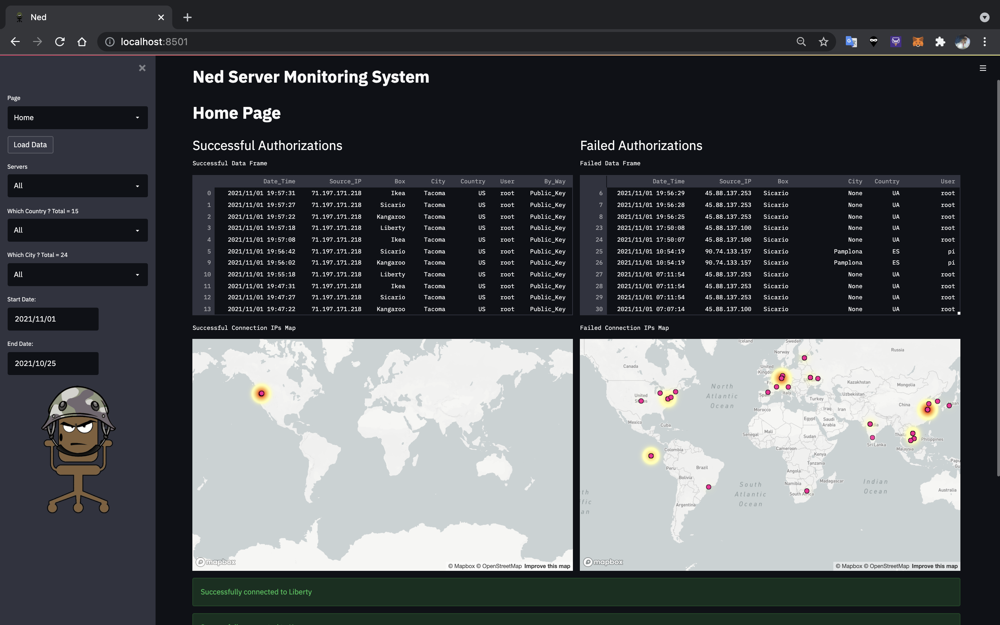
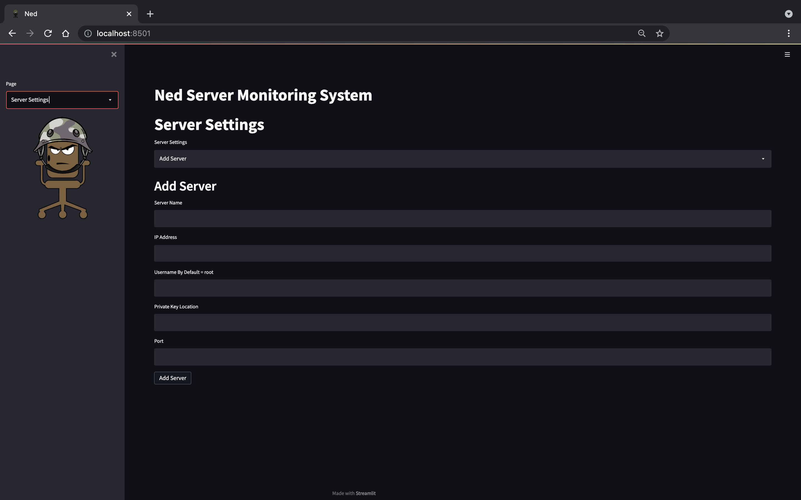
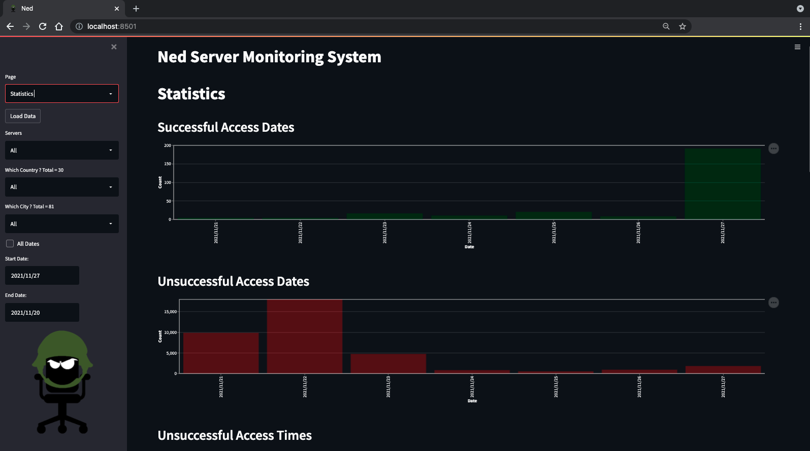
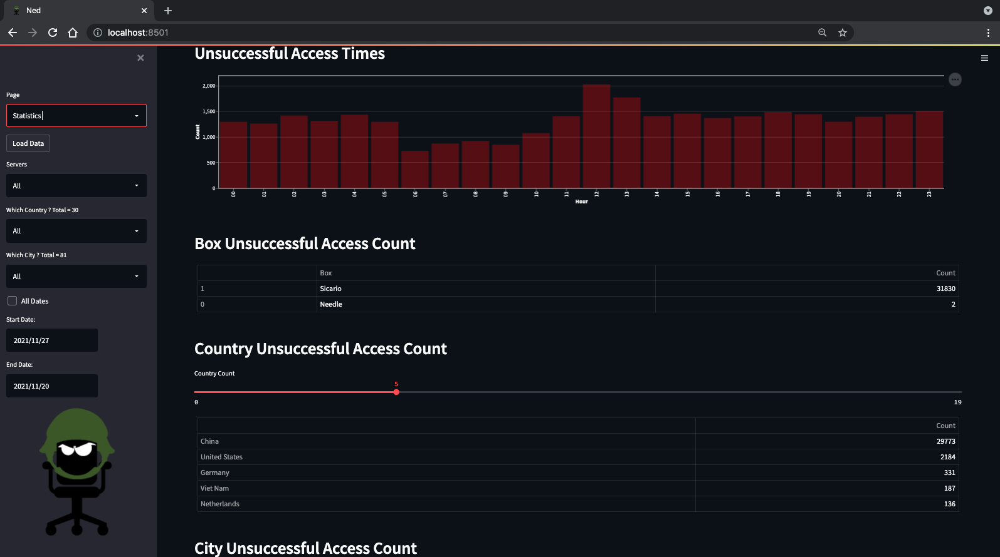
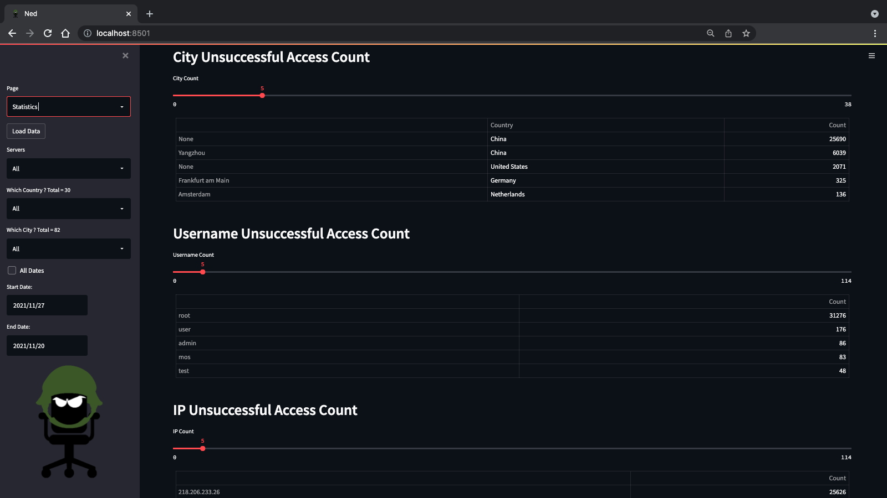

# Ned Server Monitoring System 

Ned is a server monitoring code that allows you to see what IPs have successfully and unsuccessfully connected to your servers. Ned uses Streamlit for it's GUI. 

# To install all dependencies needed:

$ pip install -r requirements.txt

# To run the code input the following:

$ streamlit run ned.py

# Steps To Connecting To Server

Creating SSH Keys
	You will first need to create SSH Keys for your server. After the keys are connected to the server, place the SSH keys in the Keys directory within the code

SSH_Config Settings
	
	In order for the code to work properly you will need to change a setting in your ssh_config file.
	
	To access the file, connect to your server
	
	Navigate to the sshd_config file which is located in /etc/ssh/sshd_config
	Unhash the Loglevel and change from INFO to VERBOSE
	
	It is also recommended to change your SSH port

Connecting Ned To Your Server

	To connect Ned to your server, open the Server Settings page and enter in your server details. If you need to change any settings you can do so by selecting Edit Server in the Server Settings Page.

		Server Name = Name of your server

		IP = The IP address of your server

		Username = The username used to connect to the server. For now root is the only user that can be used

		Port = The SSH port
	
	To confirm you have access to your server you can select Server Status in the Server Settings page

Grabbing Information From Your Server

	To get the authentication logs from your server navigate to the Home Page and select Load Data. Below the maps notifications will appear to indicate if proper connections were made.

# Home Page

The home page is the default page once opening Ned. This page displays by default the last 7 days worth of information. It includes two different data frames (Successful Authentications and Failed Authentications) as well as maps that connect to them. 

To gather information, select the Load Data option in the side bar. The code will SCP the authentication logs from your server, add it to the Ned Database, sort the relevant information, and delete the authentication log SCPed.

This page also has a map with a heat map to display which areas in the world have successfully and unsuccessfully connected to your servers. 

# Server Settings Page

The Server Settings Page is where you add, edit, delete and see the status of your servers.

# Statistics Page

The statistics page is where you can find statistical data regarding successful and unsuccessful access to your servers.

# Information Page

The Information Page describes the steps needed to connect a server.

# Looking Forward

I will be working on the following things to add to this code:

	Displaying on the Home Page data that has been transferred to and from the servers.

	Have an option to continuously pull authentication logs from servers rather than manually requesting them via the Load Data button.

	Option of identifying not just the SSH port but all ports in order to detect new attack vectors.

	Option to create SSH Keys within Ned rather than creating them outside Ned via a terminal. 

